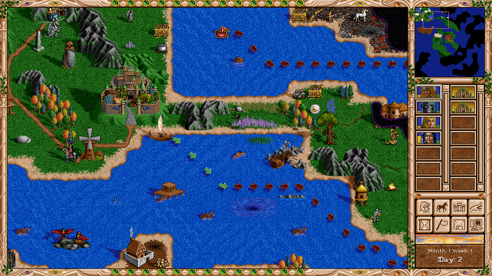
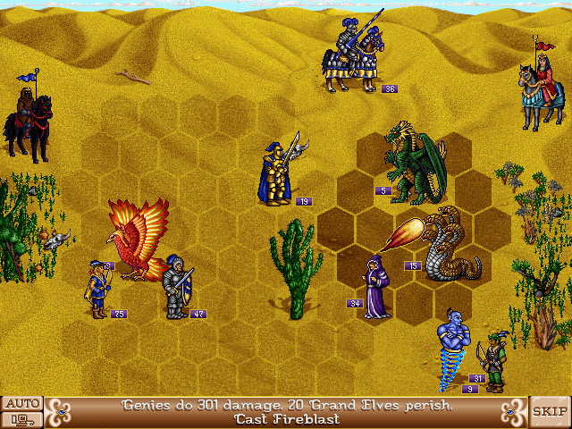
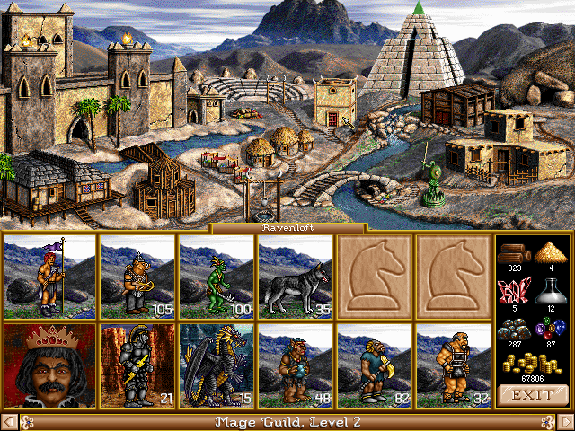

# fheroes2

**fheroes2** is a recreation of the Heroes of Might and Magic II game engine.

This open source multiplatform project, written from scratch, is designed to reproduce the original game with significant
improvements in gameplay, graphics and logic (including support for high-resolution graphics, improved AI, numerous fixes
and user interface improvements), breathing new life into one of the most addictive turn-based strategy games.

You can find a complete list of all of our changes and enhancements in [**its own wiki page**](https://github.com/ihhub/fheroes2/wiki/Features-and-enhancements-of-the-project).

<!-- markdownlint-disable MD033 -->

    

        
    

    

        
        
    

<!-- markdownlint-enable MD033 -->

## Download and Install

Please follow the [**installation guide**](INSTALL.md) to download and install fheroes2.

## Copyright

All rights for the original game and its resources belong to former The 3DO Company. These rights were transferred to Ubisoft.
We do not encourage and do not support any form of illegal usage of the original game. We strongly advise to purchase the original
game on [**GOG**](https://www.gog.com) or [**Ubisoft Store**](https://store.ubi.com) platforms. Alternatively, you can download a
free demo version of the game. Please refer to the [**installation guide**](INSTALL.md) for more information.

## License

This project is licensed under the [**GNU General Public License v2.0**](https://github.com/ihhub/fheroes2/blob/master/LICENSE).

Initially, the project was developed on [**sourceforge**](https://sourceforge.net/projects/fheroes2/).

## Contribution and Development

This repository is a place for everyone. If you want to contribute, please read more to learn [**how you can contribute**](https://github.com/ihhub/fheroes2/wiki/F.A.Q.#q-how-can-i-contribute-to-the-project).

### Developing fheroes2 engine

To build the project from source, please follow [**this guide**](DEVELOPMENT.md).

To assist with the graphical asset efforts of the project, please look at our [**graphical artist guide**](GRAPHICAL_ASSETS.md).

If you would like to help translating the project, please read the [**translation guide**](TRANSLATION.md).

### Developing fheroes2 documentation site

To build the [website](https://ihhub.github.io/fheroes2/) from source, please follow
[**this guide**](WEBSITE_LOCAL_DEV.md).

## Donation

We accept donations via [**Patreon**](https://www.patreon.com/fheroes2), [**PayPal**](https://www.paypal.com/paypalme/fheroes2) or [**Boosty**](https://boosty.to/fheroes2).
All donations will be used only for the future project development as we do not consider this project as a source of income by any means.

## Contacts

Follow us on social networks: [**Facebook**](https://www.facebook.com/groups/fheroes2) or [**VK**](https://vk.com/fheroes2).
We also have a [**Discord**](https://discord.gg/xF85vbZ) server to discuss the development of the project.

## Frequently Asked Questions (FAQ)

You can find answers to the most commonly asked questions on our [**F.A.Q. page**](https://github.com/ihhub/fheroes2/wiki/F.A.Q.).
