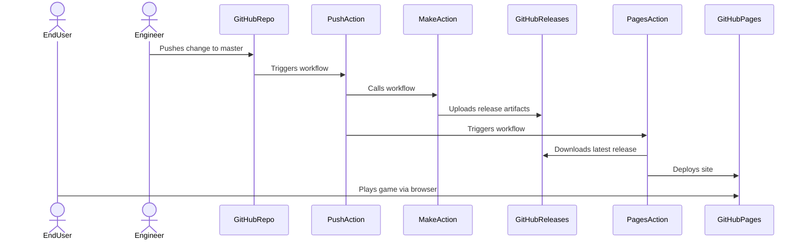

# Website Build and Deployment

This document describes the end-to-end deployment strategy for the fheroes2 site deployment.
We target Github Pages for hosting and leverage GitHub Actions for automation.

## Functionality

* Builds the documentation site for the fheroes2 project
* Deploys the site, along with WebAssembly build, to Github Pages on push.
* Allows end users to view the documentation via the web.
* Allows end users to click a link and launch the game via the web.

## Build and Deployment Diagram

## Deployment Pipeline Overview

### Trigger

* Deployment is triggered **when a new Git commit is pushed**.
* A GitHub Action workflow waits for the completion of the build-and-release process (`build.yml` workflow).

### Build Process (Upstream)

* Compiles the FHeroes2 WebAssembly bundle using Emscripten.
* Packages assets and build artifacts into a ZIP file.
* Publishes the ZIP as a GitHub Release asset using `ncipollo/release-action`.

### Deploy Process (Downstream)

* Listens for completion of the upstream `Make` workflow.
* Pulls the latest GitHub Release and extracts the ZIP bundle.
* Builds and Deploys the Github Pages with the bundle.

## GitHub Workflows Summary

### make.yml

* Triggered on `push` to branch
* Builds the application
* Publishes release assets

### pages.yml

* Triggered on completion of `build.yml`
* Builds Jekyll site
* Downloads release
* Deploys to Github Pages

## Future Considerations

* Hook up a custom domain if needed
* Allow better developer experience around pages/emscripten process for local builds
